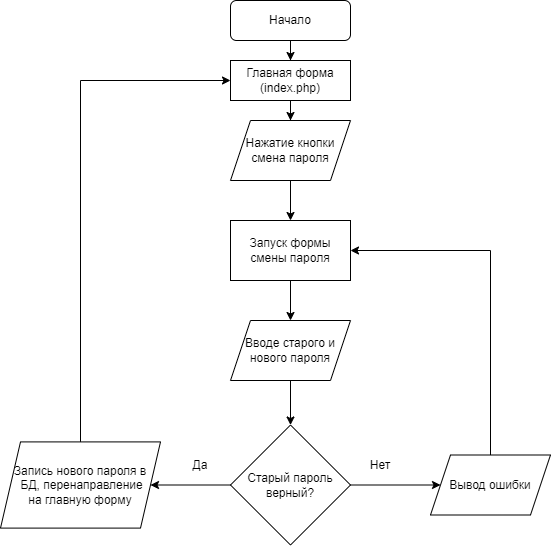
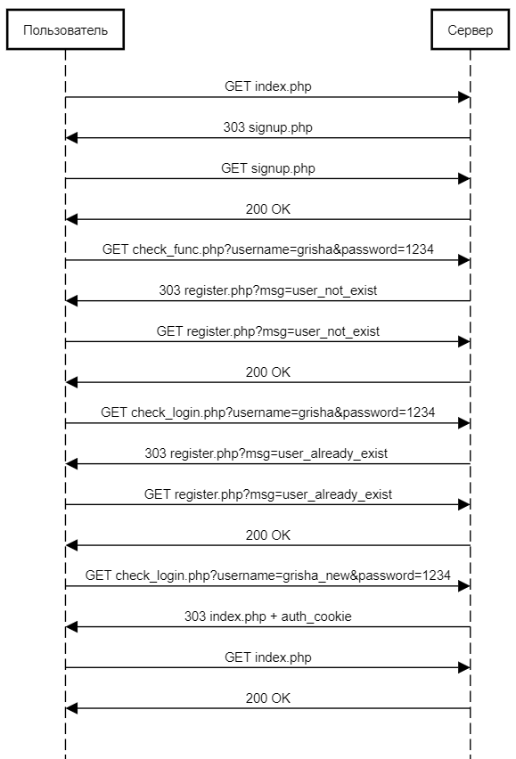

# Отчет по лабораторной работе №1 
## "HTTP аутентификация"
## по курсу "Основы программирования"
### *Работу выполнил студент группы №3131 Федоров Григорий*

#### Цель работы:
Спроектировать и разработать систему авторизации пользователей на протоколе HTTP

#### Пользовательский интерфейс (diagrams.net):

* Форма входа:

* Форма регистрации:

* Форма зарегистрированного пользователя:

* Форма смены пароля:

#### Пользовательские сценарии работы:

1. Пользователь вводит в адресной строке signup.php и попадает на форму входа. После корректного ввода всех данных он может попасть на форму регистрации, если такой пользователь не зарегистрирован или же на главную форму.   
1.1. Если пользователь попал на форму регистрации, то при вводе уже существующего имени пользователя появится сообщение об ошибке. При вводе корректных данных пользователь будет перенаправлен на главную форму.

2. При попадании на главную форму пользователь может либо сменить пароль, нажав на кнопку Change password. После этого пользователь должен ввести старый и новый пароли соответственно. При корректном вводе пользователь перенаправит на главную форму и выведет сообщение об успешной смене пароля, если пользователь обновит страницу, то сообщение исчезнет. Также при неверном старом пароле будет выведено сообщение об ошибке. На главной форме есть вторая кнопка, которая отвечает за выход с формы на форму для входа.

#### API сервера и хореография:

Сервер использует HTTP GET-запросы с названиями полей:
* username (передача логина);
* password (передача пароля). 

Также, сервер использует куки "name" и "change_password" для работы с перенаправлениями на различные формы и получении различных сообщений на страницу пользователя.

#### Структура базы данных:

База данных состоит из двух полей: имени пользователя (**username**) и его пароля (**password**). Ключевым полем является имя пользователя, оно используется в программе в качестве куки на всех для проверки.

#### Алгоритмы работы: 

* Алгоритм работы для форм signup.php и register.php:

* Алгоритм работы для форм changepass.php и index.php:

#### Примеры HTTP запросов и ответов:

#### Значимые фрагменты кода: 

* Код для проверки входа:

* Код для проверки регистрации:

* Код для смены пароля:

